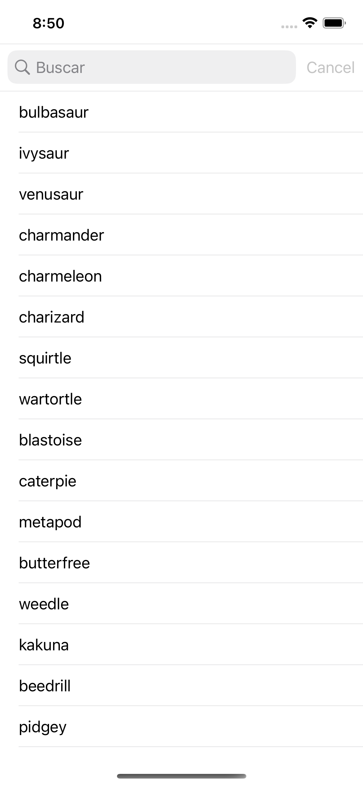
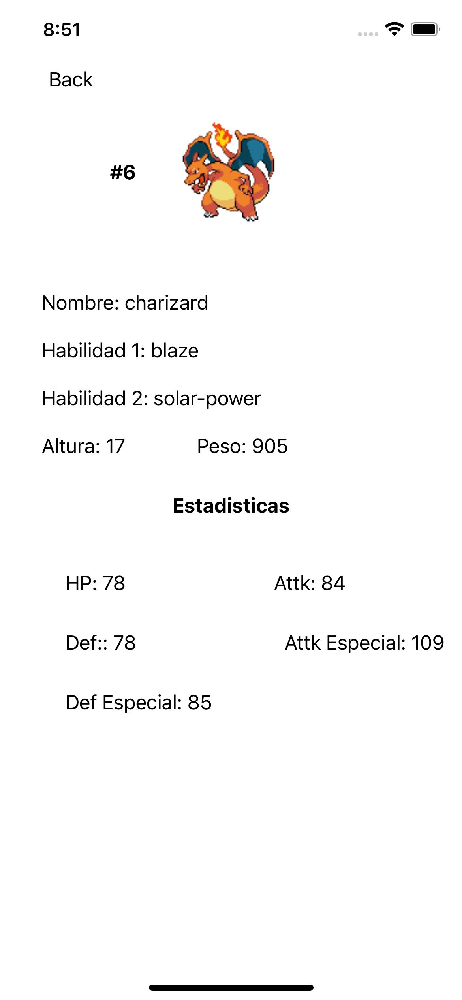

# ListadoPokemonAPI

## Ejemplo de App iOS con Swift y consumo de la API REST de Pokémon

* [PokéAPI](https://pokeapi.co)

         

## Encuéntrame en:
<!--
-->

### Autor
*Abel Lázaro. © 2022-2023*